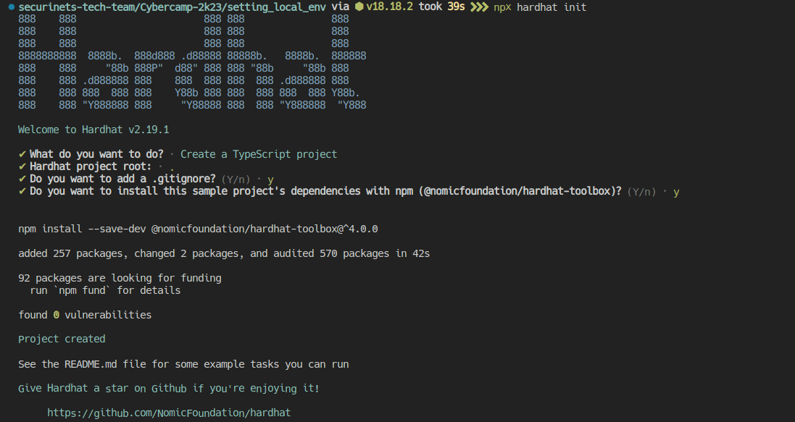
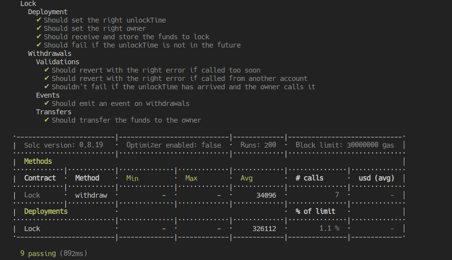

# Hardhat project workbench

This project is a template for a hardhat environment setup for easier interactions with the blockchain.



```shell
npx hardhat init 
# -- filling the needed document -- 
# -- choose typescript project -- 
#  Now the deps 
npm i @nomicfoundation/hardhat-ethers @typechain/hardhat hardhat-gas-reporter @typechain/hardhat hardhat-abi-exporter 
```

```shell
npx hardhat help
npx hardhat test
npx hardhat run scripts/deploy.ts
```

## Testing for gas



```shell
REPORT_GAS=true npx hardhat test
```

## Running a local node

```shell
npx hardhat node
```